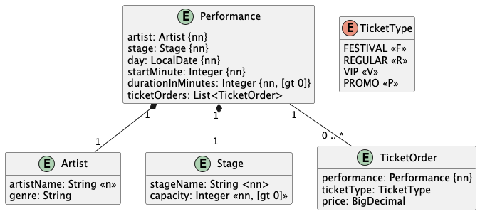

# BeatDrop — Music Festival Ticketing & Scheduling Platform

BeatDrop ist eine digitale Plattform, die Festivalveranstalter mit Fans verbindet. Veranstalter können Events erstellen, verwalten und Tickets verkaufen. Fans können Events durchsuchen, Tickets kaufen und persönliche Festivalpläne erstellen. Die Plattform vereint Ticketing (wie Ticketmaster) mit Festivalplanung und bildet reale Komplexität rund um Terminkonflikte, Preisstufen und Kapazitätsmanagement ab.

---

## Aufgaben

---

## Aufgabe 03 (Algorithmen und Datenstrukturen)

Die folgende Aufgabe soll **ohne** Datenbank und **ohne** REST API gelöst werden. Implementieren sie die geforderte Geschäftslogik in einer **Service** Klasse sowie die erforderlichen Datenklassen.

Stellen sie mittels mehrerer Tests die Funktionalität sicher. In diesen Tests sind die erforderlichen Daten zu erstellen und an den Aufruf zu übergeben.

Das umzusetzende Geschäftsmodell stellt **Künstler**, **Bühnen**, deren **Auftritte** und die dazugehörigen **Ticketverkäufe** dar. Es ist eine Konflikterkennung im Spielplan zu erstellen und daraus resultierend eine Berechnung der Kosten, die dem Veranstalter entstehen, für alle rückzuerstattenden Tickets, die von Nicht-Festivalgängern gekauft wurden.

**Geschäftsmodell Aufgabe 03**



Folgende generelle Regeln sind bei der Konflikterkennung zu beachten:

- Auftritte mit einer `durationMinutes` kleiner oder gleich 0, oder größer als 480 (8 Stunden) sind zu ignorieren
- Zwei Auftritte auf derselben Bühne am selben Tag mit überlappenden Zeiträumen ergeben einen `STAGE_OVERLAP` Konflikt.
  Beispiel: Auftritt A von 14:00 bis 14:45 (startMinute=840, durationMinutes=45) und Auftritt B von 14:30 bis 15:15 (startMinute=870, durationMinutes=45) überlappen sich von 14:30 bis 14:45
- Zwei Auftritte desselben Künstlers am selben Tag auf unterschiedlichen Bühnen mit überlappenden Zeiträumen ergeben einen `ARTIST_OVERLAP` Konflikt.
  Beispiel: Künstler X spielt von 14:00 bis 14:45 auf Bühne A und gleichzeitig von 14:15 bis 15:00 auf Bühne B
- Doppelte Konflikte (A,B) und (B,A) sollen nicht im Ergebnis erscheinen - jeder Konflikt soll nur einmal gemeldet werden
- Tritt ein `STAGE_OVERLAP` Konflikt auf, sind alle Tickets des *später beginnenden* Auftritts rückzuerstatten, **sofern** das später beginnende Konzert zu mehr als 25% seiner Gesamtspielzeit mit dem früher beginnenden überlagert ist.
- Tritt ein `ARTIST_OVERLAP` Konflikt auf, sind alle Tickets des *später beginnenden* Künstlers rückzuerstatten.
- Rückzuerstatten sind nur Tickets für Nicht-Festival-Gänger, wobei folgende Logik zu berücksichtigen ist:
  - Reguläre Tickets werden zu 75% rückerstattet.
  - VIP Tickets werden zu 100% rückerstattet.
  - Promo Tickets werden nicht rückerstattet.

Implementieren sie einen **Schedule Conflict Service** wie folgt (Pseudo code):

```
klasse TicketRefundService {
  ## Die Stages werden zu Beginn an das Service
  ## übergeben
  TicketRefundService(Liste<Stage> stages)

  ## Finden sie alle zu refundierenden Tickets auf der
  ## angegebenen Stage
  Liste<TicketRefund> conflictsForStage(
    Liste<Performance> performances,
    Stage stage
  )

  ## Finden sie alle zu refundierenden Tickets für den
  ## angegebenen Künstler
  Liste<TicketRefund> conflictsForArtist(
    Liste<Performance> performances,
    Artist artist
  )
}
```

> **Hinweis:** Dieser Pseudo Code soll als Inspiration ihrer Lösung dienen - passen sie diese Vorgabe entsprechend ihrer Programmiersprache und den Notwendigkeiten an.

Ihre Aufgabe besteht darin das `TicketRefundService` mit Initialisierung und den Geschäftslogikmethoden zu implementieren. Überlegen Sie sich eine geeignete Datenstruktur `TicketRefund`, in welcher Sie die konfliktierenden Auftritte mitsamt der entstehenden Kosten auflisten.

Um den Beweis der Richtigkeit ihrer Lösung anzutreten sind auch Tests zu implementieren.

---

## Aufgabe 04 (REST API)

In der **Aufgabe 04** geht es um die Umsetzung eines **REST APIs**.

Inhaltlich sollen Künstler (Artist) für das BeatDrop Festival erstellt und verwaltet werden.

Ein Künstler soll dabei folgende Eigenschaften haben:

| Attribut | Beschreibung |
|---|---|
| Künstlername | dieser dient als eindeutige Identifikation - Beispielwerte: `DJ Electric`, `The Rockers`, `Luna-M` |
| Genre | das musikalische Genre - z.B. `Electronic`, `Rock`, `Jazz` |
| Biografie | ein optionaler Text mit Hintergrundinformationen zum Künstler |
| Social Media Handle | ein optionaler Social Media Handle - z.B. `@djelectric` |

**Beispiel Künstler als JSON**

```json
{
  "artistName": "DJ Electric",
  "genre": "Electronic",
  "biography": "Award-winning electronic music producer from Vienna",
  "socialMediaHandle": "@djelectric"
}
```

Es soll nun der Endpunkt für `/api/artists` erstellt werden. Dieser soll folgende Funktionen ermöglichen:

| Funktion | Beschreibung |
|---|---|
| Finden aller Künstler | Soll im JSON Format eine Liste aller bekannten Künstler liefern. Wenn keine Künstler vorhanden sind so soll eine leere Liste geliefert werden. |
| Finden eines spezifischen Künstlers anhand des Künstlernamens | Liefert den gefundenen Künstler als JSON. Wenn der Künstler nicht gefunden wird, ist der entsprechende Status Code zu liefern. |
| Erstellen eines neuen Künstlers | Die Daten des neuen Künstlers werden als JSON übergeben (und sind zu validieren). Achten sie hier auf einen HTTP konformen Antwortstatus. Sollte das Anlegen nicht möglich sein ist ein entsprechender Fehlerstatus zu liefern. Wie ist das korrekte Verhalten, wenn ein Künstler mit dem selben Namen schon existiert? |
| Ersetzen eines existierenden Künstlers anhand seines Namens | Der Künstlername muss übergeben werden sowie die neuen Künstler Daten als JSON. Sollten die Daten nicht korrekt sein ist ein entsprechender Fehlerstatus zu liefern. Wie ist das korrekte Verhalten, wenn ein Künstler mit dem gegebenen Namen nicht existiert? |

Verwenden sie zur Implementierung dieser Funktionen die geeigneten **HTTP Methoden**. Liefern sie immer die entsprechenden Status Werte zurück. Testen sie ihre Funktionen für erfolgreiche als auch fehlerhafte Aufrufe.

Es ist der **Endpunkt** zu implementieren - die Service-Schicht darunter ist nur als **Stub** zu erstellen und im Test via **Mocking** zur Verfügung zu stellen.

> **Wichtig:** Es ist damit **ein** Endpunkt mit **vier** Funktionen und einiger Details sowie Tests zu implementieren.

---

## Aufgabe 05 (REST API)

In der **Aufgabe 05** fügen wir ein weiteres **REST API** hinzu.

Inhaltlich sollen Auftritte (Performances) für das BeatDrop Festival erstellt und verwaltet werden.

Ein Auftritt soll dabei folgende Eigenschaften haben:

| Attribut | Beschreibung |
|---|---|
| Identifizierung | eine eindeutige, beim Erstellen generierte Identifizierung des Auftritts (UUID) |
| Künstler | der Name des auftretenden Künstlers - z.B. `DJ Electric` |
| Bühne | der Name der Bühne auf der der Auftritt stattfindet - z.B. `Main Stage` |
| Tag | der Tag für welchen dieser Auftritt geplant ist - Datum im ISO Format `yyyy-MM-dd` |
| Startzeit | die Startzeit des Auftritts im Format `HH:mm` - z.B. `14:00` |
| Dauer | die Dauer des Auftritts in Minuten - z.B. `60` |

**Beispiel Auftritt (Erstellung)**

```json
{
  "artistName": "DJ Electric",
  "stageName": "Main Stage",
  "day": "2026-07-15",
  "startTime": "14:00",
  "durationMinutes": 60
}
```

**Beispiel Auftritt (Abfrage)**

```json
{
  "identifier": "a1b2c3d4-e5f6-7890-abcd-ef1234567890",
  "artistName": "DJ Electric",
  "stageName": "Main Stage",
  "day": "2026-07-15",
  "startTime": "14:00",
  "durationMinutes": 60
}
```

Es soll einen Endpunkt geben - `/api/performances` mit folgenden Funktionen:

| Funktion | Beschreibung |
|---|---|
| Finden aller Auftritte | Soll im JSON Format eine Liste aller bekannten Auftritte liefern. Wenn keine Auftritte vorhanden sind so soll eine leere Liste geliefert werden. |
| Finden eines spezifischen Auftritts anhand der Identifizierung | Liefert den gefundenen Auftritt als JSON. Wenn der Auftritt nicht gefunden wird, ist der entsprechende Status Code zu liefern. |
| Erstellen eines neuen Auftritts | Die Daten des neuen Auftritts werden als JSON übergeben (und sind zu validieren). Achten sie hier auf einen HTTP konformen Antwortstatus. Sollte das Anlegen nicht möglich sein ist ein entsprechender Fehlerstatus zu liefern. |

Verwenden sie zur Implementierung dieser Funktionen die geeigneten **HTTP Methoden**. Liefern sie immer die entsprechenden Status Werte zurück. Testen sie ihre Funktionen für erfolgreiche als auch fehlerhafte Aufrufe.

Es ist der **Endpunkt** zu implementieren - die Service-Schicht darunter ist nur als **Stub** zu erstellen und im Test via **Mocking** zur Verfügung zu stellen.

> **Wichtig:** Es ist damit **ein** Endpunkt mit **drei** Funktionen und einiger Details sowie Tests zu implementieren.

Es ist nun der obige Endpunkt - `/api/performances` - zu erweitern damit die Informationen über die Bühne des Auftritts zurückgeliefert werden. Mit einem Resource Path wie z.B.

`/api/performances/{performanceId}/stage-info`

und einem Ergebnis:

**Bühneninformationen des Auftritts**

```json
{
  "stageName": "Main Stage",
  "capacity": 5000,
  "description": "The main outdoor stage"
}
```

Auch diese Implementierung ist zu testen!
